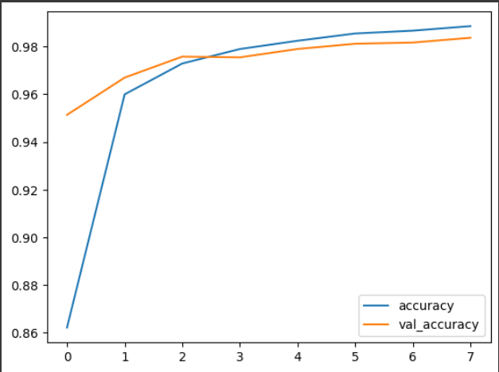
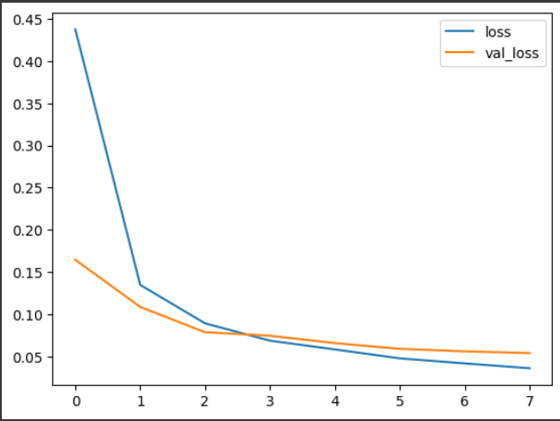
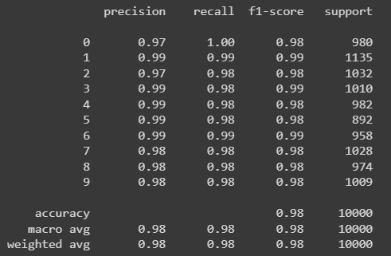
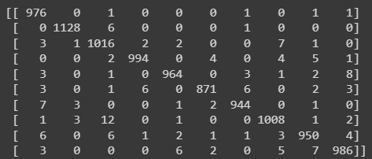
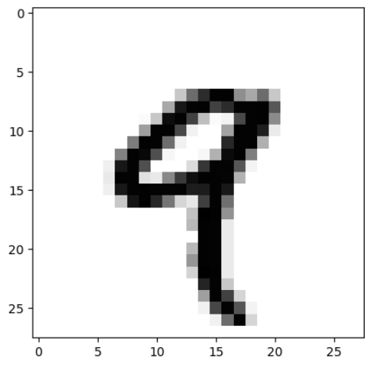
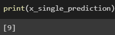

## EX-3 Convolutional Deep Neural Network for Digit Classification

## AIM

To Develop a convolutional deep neural network for digit classification and to verify the response for scanned handwritten images.

## Problem Statement and Dataset
Digit classification and to verify the response for scanned handwritten images.

The MNIST dataset is a collection of handwritten digits. The task is to classify a given image of a handwritten digit into one of 10 classes representing integer values from 0 to 9, inclusively. The dataset has a collection of 60,000 handwrittend digits of size 28 X 28. Here we build a convolutional neural network model that is able to classify to it's appropriate numerical value.


## Neural Network Model

Include the neural network model diagram.

## DESIGN STEPS

### STEP 1:

import tensorflow and preprocessing libraries
### STEP 2:
Build a CNN model

### STEP 3:

Compile and fit the model and then predict

## PROGRAM
```
Name : SWATHIKA G
Reg No : 212221230113
```
```PY

import numpy as np
import pandas as pd
from tensorflow import keras
from tensorflow.keras import layers
from tensorflow.keras.datasets import mnist
import tensorflow as tf
import matplotlib.pyplot as plt
from tensorflow.keras import utils
from sklearn.metrics import classification_report,confusion_matrix
from tensorflow.keras.preprocessing import image

(xtrain, ytrain), (xtest, ytest) = mnist.load_data()

xtrain.shape

xtest.shape

single_image= xtrain[4]

single_image.shape

plt.imshow(single_image,cmap='gray')

ytrain.shape

xtrain.min()

xtrain.max()

xtrain_scaled = xtrain/255.0
xtest_scaled = xtest/255.0

xtrain_scaled.min()

xtrain_scaled.max()

ytrain[4]

ytrain_onehot = utils.to_categorical(ytrain,10)
ytest_onehot = utils.to_categorical(ytest,10)

type(ytrain_onehot)

ytrain_onehot.shape

single_image = xtrain[4]
plt.imshow(single_image,cmap='gray')

ytrain_onehot[4]

xtrain_scaled = xtrain_scaled.reshape(-1,28,28,1)
xtest_scaled = xtest_scaled.reshape(-1,28,28,1)

model= keras.Sequential()
model.add(layers.Input(shape=(28,28,1)))
model.add(layers.Conv2D(filters=32,kernel_size=(3,3),activation='relu'))
model.add(layers.MaxPool2D(pool_size=(2,2)))
model.add(layers.Flatten())
model.add(layers.Dense(16,activation='relu'))
model.add(layers.Dense(32,activation='relu'))
model.add(layers.Dense(64,activation='relu'))
model.add(layers.Dense(10,activation='softmax'))

model.summary()

model.compile(loss='categorical_crossentropy',
              optimizer='adam',
              metrics='accuracy')

model.fit(xtrain_scaled ,ytrain_onehot, 
          epochs=8,batch_size=128, 
          validation_data=(xtest_scaled,ytest_onehot))

metrics = pd.DataFrame(model.history.history)
metrics.head()

metrics[['accuracy','val_accuracy']].plot()

metrics[['loss','val_loss']].plot()

xtest_predictions = np.argmax(model.predict(xtest_scaled), axis=1)

print(confusion_matrix(ytest,xtest_predictions))

print(classification_report(ytest,xtest_predictions))

img = image.load_img('dl.png')
type(img)
img = image.load_img('dl.png')
img_tensor = tf.convert_to_tensor(np.asarray(img))
img_28 = tf.image.resize(img_tensor,(28,28))
img_28_gray = tf.image.rgb_to_grayscale(img_28)
img_28_gray_scaled = img_28_gray.numpy()/255.0

x_single_prediction = np.argmax(model.predict(img_28_gray_scaled.reshape(1,28,28,1)),axis=1)

print(x_single_prediction)

plt.imshow(img_28_gray_scaled.reshape(28,28),cmap='gray')

img_28_gray_inverted = 255.0-img_28_gray
img_28_gray_inverted_scaled = img_28_gray_inverted.numpy()/255.0
plt.imshow(img_28_gray_inverted_scaled.reshape(28,28),cmap='gray')

x_single_prediction = np.argmax(model.predict(img_28_gray_inverted_scaled.reshape(1,28,28,1)), axis=1)

print(x_single_prediction)
```

## OUTPUT
### Training Loss, Validation Loss Vs Iteration Plot




### Classification Report



### Confusion Matrix



### New Sample Data Prediction





## RESULT :
Thus a convolutional deep neural network for digit classification and to verify the response for scanned handwritten images is written and executed successfully.
